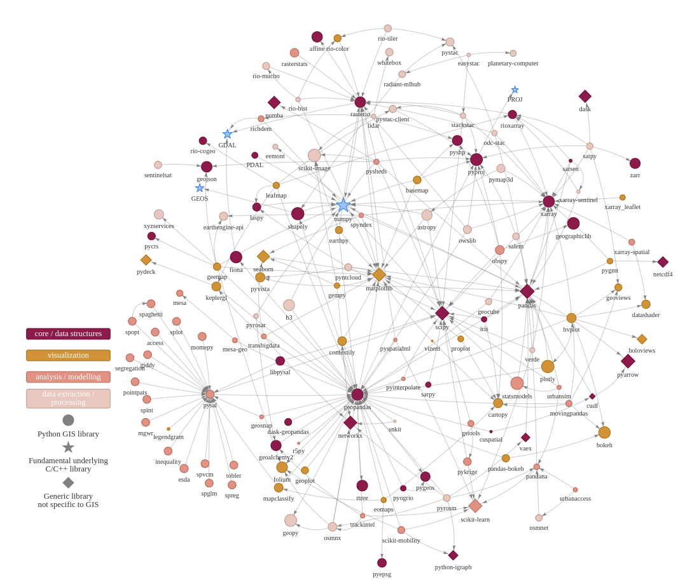

Python OS Ecosystem for GIS and Earth Observation
=================================================

This website aims to list all open-source (OS) Python libraries that can be used for doing
various operations, analyses, visualizations etc. related to GIS and Earth Observation.
The libraries are categorized into ``core / data structures``, ``analysis & modelling``, ``visualization``,
and ``data extraction / processing``. There are separate pages listing packages
that are commonly used to work with vector or raster data, or which are generic packages
(not specific to data type or GIS in general). You can browse through the website by clicking on the links
on the left.

**Why?** The origin of this website was to support `pythongis.org <https://pythongis.org>`_ -project which is an open online book giving an
*Introduction to Python for Geographic Data Analysis*. However, the book and this website have separate lives
and are not strictly bound to each other. We believe it is useful to have a dedicated website providing a good overview of Python
Ecosystem for GIS and Earth Observation with relevant information.

**Inspiration**: This website is heavily inspired by `pyviz.org <http://pyviz.org>`_ which provides similar information related to Python
visualization libraries. However, the websites do not have anything else in common (except the inspiration), as the underlying mechanisms
for generating the content are totally different.

   Python GIS/EO ecosystem linkages (click to enlarge).

.. toctree::
   :maxdepth: 2
   :caption: Tools

   all-tools.ipynb
   vector-libraries.ipynb
   raster-libraries.ipynb
   generic-libraries.ipynb
   
.. toctree::
   :maxdepth: 2
   :caption: Maintenance

   contributing.ipynb
   